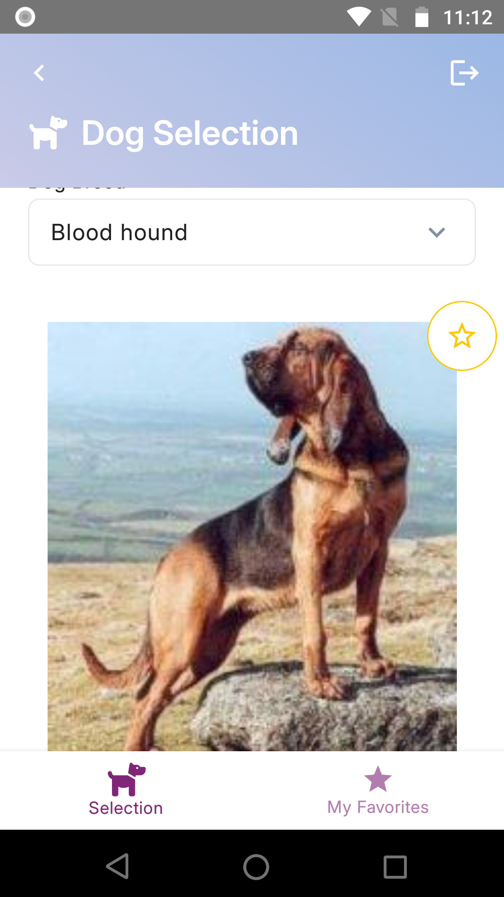
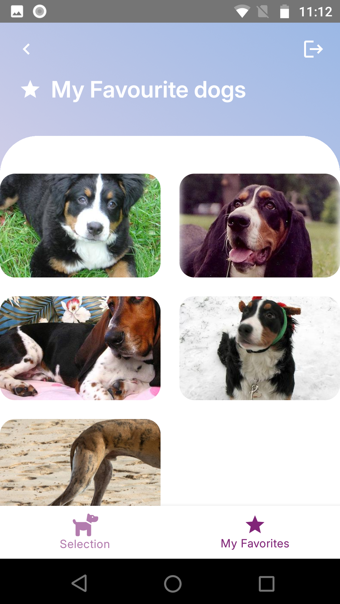

# Dog Showcase App

An Android application that fetches random dog images from the [Dog CEO API](https://dog.ceo/dog-api/) and displays them to users. Users can view various dog breeds and save their favorite ones for easy access.

## Features

- **Dog Selection Screen**: Displays a variety of dog images, allowing users to browse through different breeds.
- **Favorites Screen**: Enables users to save and view their favorite dog images.
- **Offline Access**: Stores favorite images locally, making them accessible even without an internet connection.

## Screenshots

### Dog Selection Screen


### Favorites Screen


## Future Improvements

- **Login Integration**: Implement user authentication, allowing users to log in and save their preferences across devices using Firebase SDK.
- **Loading state**: Handle loading state for more scenarios
- **Enhanced Offline Mode**: Improve the offline functionality by caching images.
- **Breed Filters and Sorting**: Add filters and sorting options, enabling users to browse dogs by breed, size, and other characteristics.

## Known Bugs

- On selection screen when clicking to add or remove to favorite the image is resizing for some reason

## Getting Started

1. Clone the repository:
   ```bash
   git clone https://github.com/your-username/dog-showcase-app.git

## Layers

The app is structured following a multi-layered architecture to separate concerns and improve scalability and maintainability.

- **Repositories**: Repositories act as intermediaries between data sources and the rest of the app, handling the logic for choosing between local and remote data sources and ensuring data consistency. The repository classes for `dogSelection` and `favorites` modules make it easy to manage where data is sourced from.

- **Sources**: Data sources are split into `LocalSource` and `RemoteSource` classes, following the Repository pattern.
    - `RemoteSource` is responsible for handling API calls to fetch the latest dog images.
    - `LocalSource` manages data stored locally, including favorites saved by the user.

- **Core**: The core module contains shared utilities, data structures, and dependency injection setup. This includes:
    - **DI (Dependency Injection)**: Uses Hilt for dependency injection, allowing the app's components to be loosely coupled and easily testable.
    - **Navigation**: Defines navigation logic and routes, enabling seamless transitions between screens.
    - **Presentation Components**: Contains UI components and models shared across different screens of the app.

- **Extension Functions**: The `ktx` folder contains custom Kotlin extension functions that enhance readability and reduce boilerplate code throughout the app. These utilities help streamline common tasks, such as formatting data or simplifying view-related operations.

## Dependencies

| Library                 | Version       | Description                                                                                  |
|-------------------------|---------------|----------------------------------------------------------------------------------------------|
| Android Gradle Plugin   | 8.5.2         | Manages the build process for Android projects.                                              |
| Activity Compose        | 1.9.2         | Provides support for integrating Android activities with Jetpack Compose.                    |
| Coil Compose            | 3.0.0-rc01    | Image loading library optimized for Compose, used for loading and displaying dog images.     |
| Coil Network OkHttp     | 3.0.0-rc01    | Enhances Coil with OkHttp support for network-related image fetching.                        |
| Compose BOM             | 2024.04.01    | Manages consistent versions of Compose libraries to ensure compatibility.                    |
| Converter Gson          | 2.9.0         | Converts JSON responses into Kotlin objects for easy API response handling with Retrofit.    |
| Espresso Core           | 3.6.1         | Used for UI testing, ensuring the app behaves as expected in different scenarios.            |
| Hilt                    | 2.49          | Dependency Injection framework, used to manage app components and dependencies.              |
| Hilt Navigation Compose | 1.2.0         | Integrates Hilt with Jetpack Compose navigation.                                             |
| Kotlin                  | 1.9.22        | Programming language used for app development.                                               |
| Core KTX                | 1.13.1        | Provides Kotlin extensions for Android core libraries to improve syntax and readability.     |
| JUnit                   | 4.13.2        | Unit testing framework for testing individual units of code.                                 |
| AndroidX JUnit          | 1.2.1         | Extended JUnit support for Android, used in combination with JUnit for better Android tests. |
| Kotlinx Datetime        | 0.6.1         | Provides Kotlin support for date and time operations, useful for timestamp management.       |
| Lifecycle Runtime KTX   | 2.8.6         | Manages lifecycle-aware components, making it easier to handle app state and lifecycle.      |
| Logging Interceptor     | 5.0.0-alpha.2 | Adds logging capabilities to network requests, helping with debugging and monitoring.        |
| Material                | 1.7.4         | Provides Material Design components, ensuring the app follows design guidelines.             |
| Navigation Compose      | 2.8.3         | Adds navigation support to Compose, enabling in-app screen transitions.                      |
| OkHttp                  | 5.0.0-alpha.2 | HTTP client for networking, used to handle API calls to the Dog CEO API.                     |
| Retrofit                | 2.9.0         | REST client for network requests, used to interact with Dog CEO API.                         |
| Room                    | 2.6.1         | SQLite database abstraction, allowing local data storage for offline access to favorites.    |

These dependencies collectively support various aspects of the app, from UI rendering and image loading to dependency injection, networking, and local data storage.

